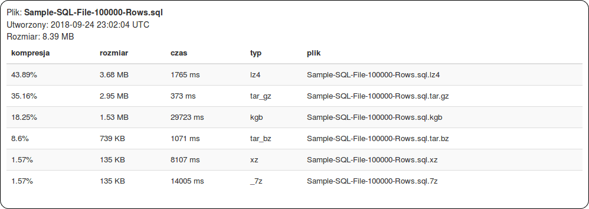
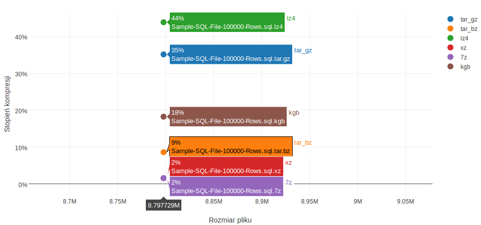
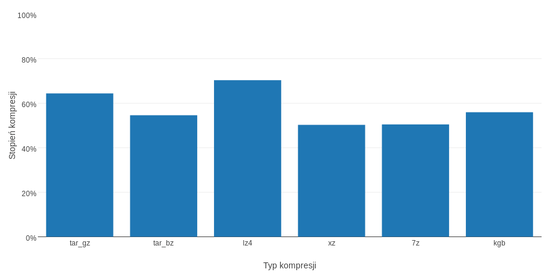
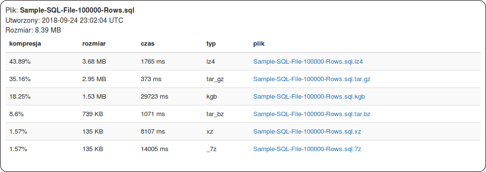

# OESK Archiver

Project created on studies for OESK classes.

pl: Ocena efektywności programów komputerowych

eng. Computer programs efficiency evaluation

Run to update database:
```sh
$ rails db:migrate
```

REQUIREMENTS: Compressions programs that need to be installed (must be known for terminal):
- tar
- [lz4](https://github.com/lz4/lz4/tree/master)
- [xz](https://packages.ubuntu.com/xenial/xz-utils)
- [7z](http://manpages.ubuntu.com/manpages/xenial/man1/7z.1.html)
- [kgb](http://manpages.ubuntu.com/manpages/xenial/man1/kgb.1.html)

To read about how these commands were used look to the [uploaded_files_controller.rb](https://github.com/bartekadams/oesk-archiver/blob/master/app/controllers/uploaded_files_controller.rb#L88) .

Tested on Xubuntu 16.04.

The results of compression:


All uploaded files one type can be compared on one graph:


Diffrent compression types:


Uncomment [this](https://github.com/bartekadams/oesk-archiver/blob/master/app/views/uploaded_files/index.html.haml#L39) to enable downloading compressed files.

